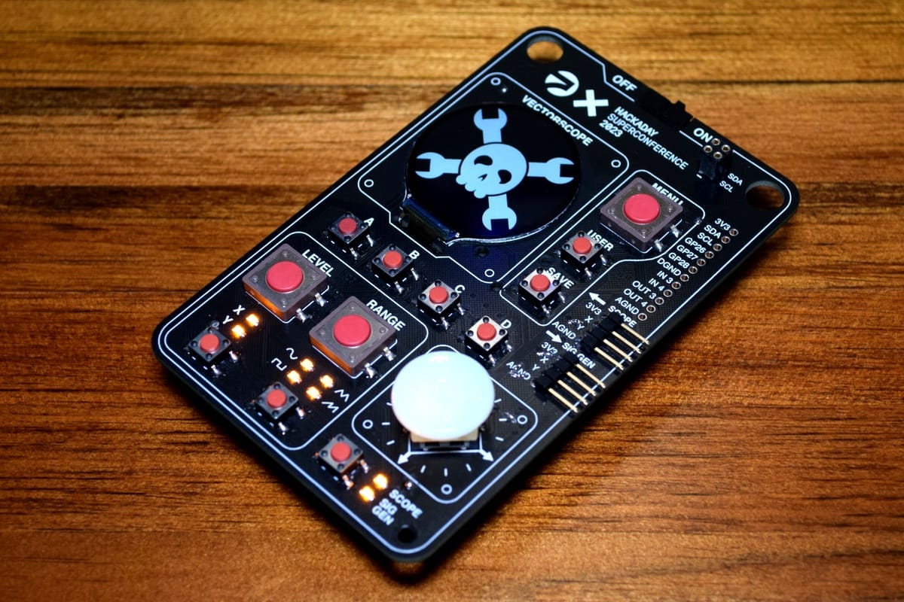

# HackadayVectorscopeHacks

### Hacks so far

#### CircuitPython

Uses standard Raspberry Pi Pico build of CircuitPython with `gc9a01` driver in Community Bundle.

* [fake_vectorscope1.py](./circuitpython/fake_vectorscope1.py)
  -- using multiple `vectorio` objects to make the phospher trails, can't have too many.

* [fake_vectorscope2_lissajous.py](./circuitpython/fake_vectorscope2_lissajous.py)
  -- ([video demo](https://mastodon.social/@todbot/111275574436711965))
    drawing on `Bitmap` without trying to erase, looks pretty good but no fading trails

#### Arduino

Uses standard `arduino-pico` core with `Arduino_GFX` library to drive the display.

* [fakey_vectorscope_lissajous.ino](./arduino/fakey_vectorscope_lissajous.ino)
  -- ([video demo](https://mastodon.social/@todbot/111279891762130663))
  pretty good looking trails, but they fight with the grid lines

#### Micropython

Uses UF2 from https://github.com/russhughes/gc9a01_mpy but it seems pretty unstable,
wiping out the entire flash contents and requiring a reinstall of Micropython.
And the font mpy files provided do not work with the provided UF2.

* [gc9a01_test.py](./micropython/gc9a01_test.py)

### Links:
* [Hackaday Teaser](https://hackaday.com/2023/10/18/2023-hackaday-supercon-badge-welcome-to-the-vectorscope/)
* [Hackaday Vectorscope repo](https://github.com/Hack-a-Day/Vectorscope)

